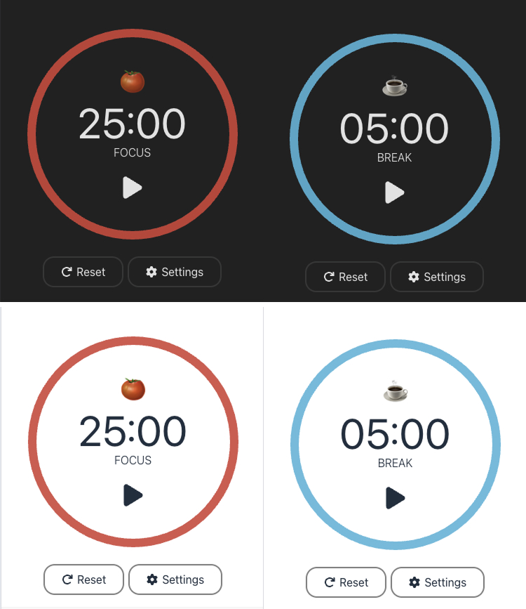

# Pomodoro Timer 🍅

A simple and interactive Pomodoro Timer app to boost productivity using focused work intervals.

---

## Demo

[Live Demo](https://viviantangdev.github.io/pomodoro/)

---

## Features

- Start, pause and reset the timer
- Customizable work and break durations
- Dark/light mode support (follows system theme)
---

## Usage

- Click Play button to begin the Pomodoro timer.
- Take a break when the timer ends.
- Adjust work/break durations in the settings if needed.
---

## Technologies Used

- React – Core library for building the user interface and handling state. 
- Tailwind CSS – Utility-first CSS framework for styling and responsive layouts. 
- Vite/Create React App – Development server and build tool for fast setup and bundling.  
- React Circular Progressbar – Displays the Pomodoro timer’s progress visually.  
- React Icons – Icon library for buttons and UI elements.
---